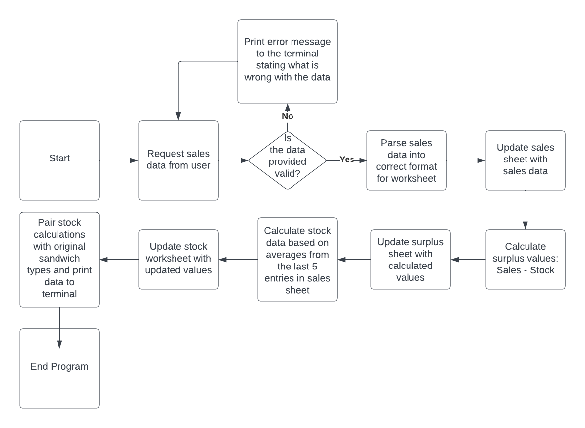

# Program Structure
Program should do the following:
- Collect sales data from the user
- Add sales data into sales worksheet
- Calculate surplus numbers
- Add surplus data to worksheet
- Calculate the average sales for the last 5 markets
- Add calculated stock numbers into the stock worksheet
- Print stock recommendations to the terminal
- Check the sales data input from the user is valid

Flowchart of process
